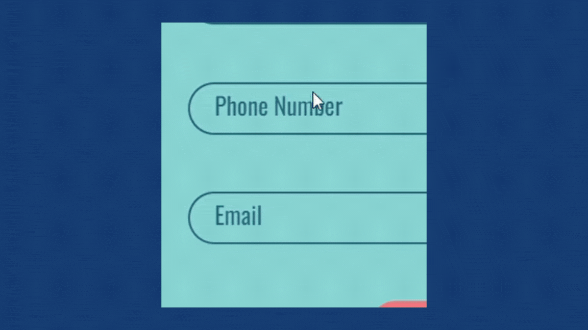
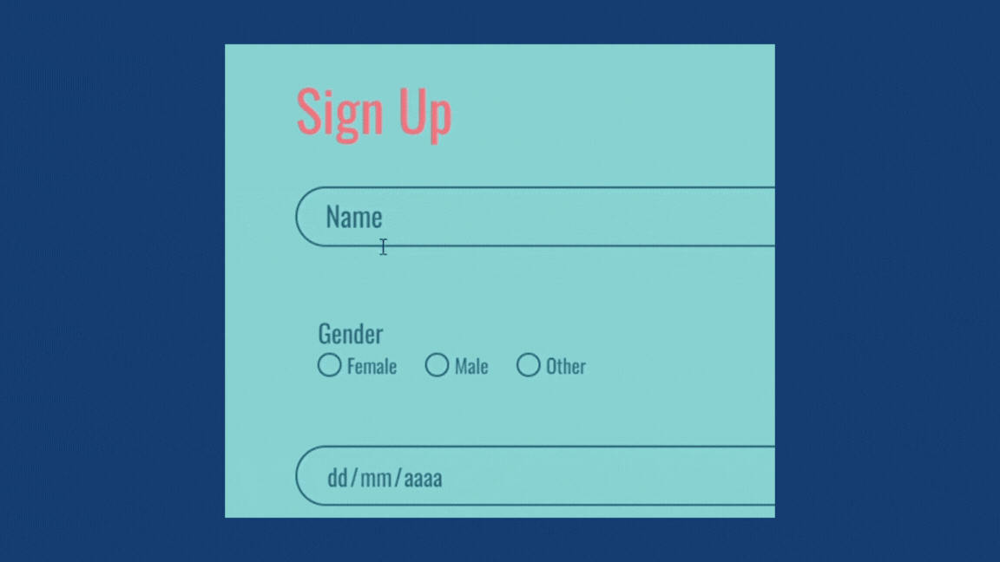
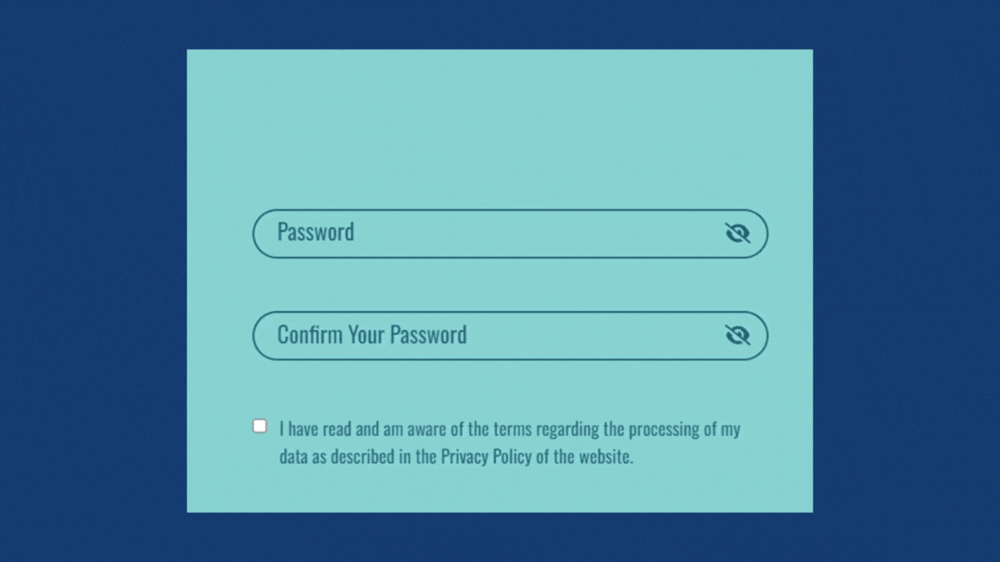
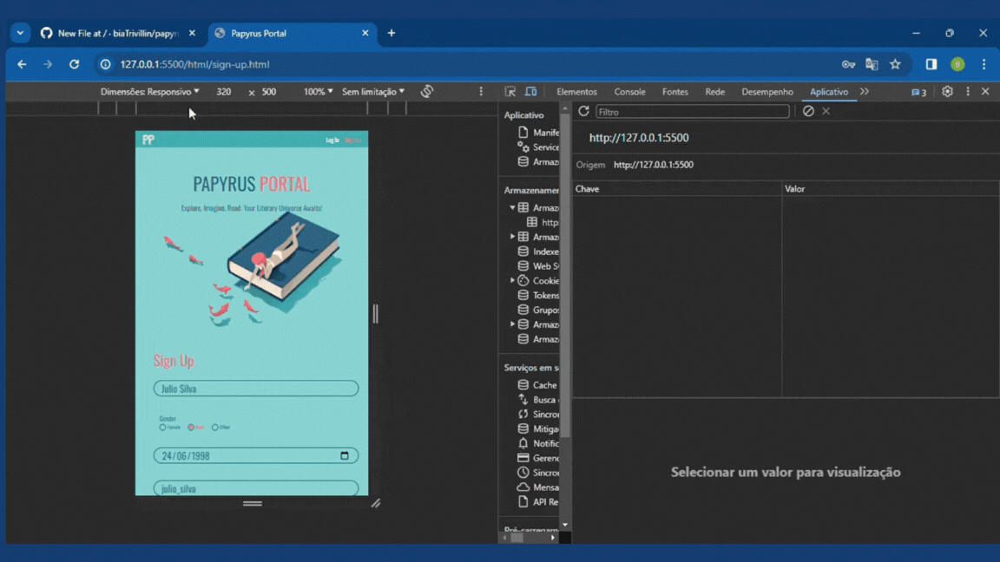

# 📖 Papyrus Portal 📖
>This project focuses on implementing the login and sign-up pages of the Papyrus Portal, a platform that combines reading organization features with an online book store.
<br>

## Preview
<div align="center">
  
</div> <br>

## Features and Details

- The project's design was developed with a mobile-first approach, enabling the creation of a responsive page with minimal interventions through media queries.
<div align="center">
  
</div><br><br>

- Masks were implemented to format values entered in the sign up page input fields, indicating valid formats and making the information more visually accessible. The use of these masks enhances the usability of the page and helps ensure the integrity of the data provided to the system. The following regular expressions (regex) were employed in the JavaScript code for this purpose.


```JavaScript
//password ----------------------------------------------------------

(?=.*\d) //request at least one number in the password
(?=.*[a-z]) //request at least one lowerercase letter
(?=.*[A-Z]) //request at least one uppercase letter
(?=.*[$*&@#]) //request at least one special character
^[0-9a-zA-Z$*&@#]{8,}$ //request at least 8 characters

//email -------------------------------------------------------------

^[_a-z0-9-]+(\.[_a-z0-9-]+)*@[a-z0-9-]+(\.[a-z0-9-]+)*(\.[a-z]{2,4})$
//text@text.text

//phone -------------------------------------------------------------

phone.value = phone.value.replace(/\D/g,'') //allows just numbers
phone.value = phone.value.replace(/(\d{2})(\d)/,"($1) $2") //brazillian number format with area code in parentheses
phone.value = phone.value.replace(/(\d)(\d{4})$/,"$1-$2") //brazilian landline and mobile number format.
```
<div align="center">
  
</div><br>
<br><br>

- Implementation of a floating label that allows the display of the field title even when it is in focus.
- Password visibility option and a span displaying the required pattern, enhancing the usability of the page.
<div style="display: inline_block">
  
  
</div><br><br>

- Efficient sign-up system that allows data submission only when all fields are filled with valid information.
<div style="display: inline_block">
  
  
</div> <br><br>

- Efficient login system that identifies and signals invalid information.
<div style="display: inline_block">
  
  
</div> <br><br>

- Storage of information through localStorage.
<div align="center">
  
</div> <br><br>

- Creation of a random token with each new login, preventing access by users not logged into the session.
<div align="center">
  
</div> <br><br>

## Deploy
The project was deployed using the Vercel platform and is available at the [link](https://papyrus-portal-pi.vercel.app/)
<br><br>


## Technologies used in the project.
<div align="left">
  
  
  
  
  
  
  
  
  
</div>
<br>


